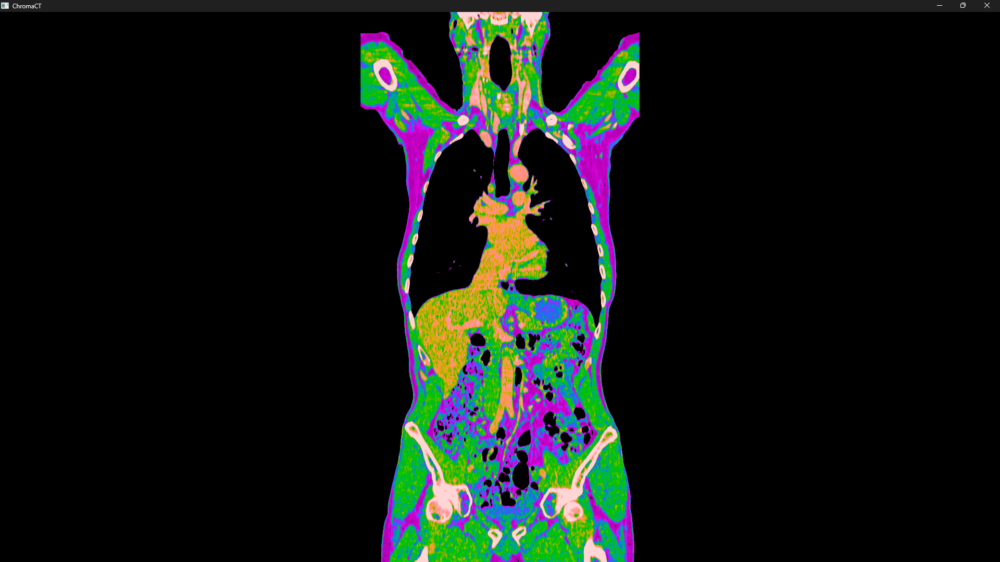
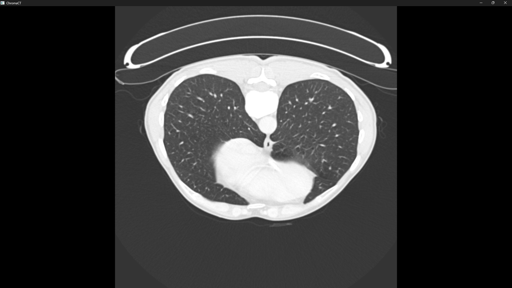
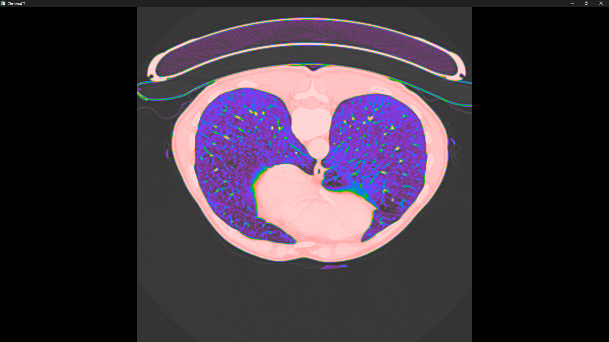

# ChromaCT

A basic DICOM viewer for CT scans built with Rust, Bevy, and WGSL.

It supports multi-planar reconstruction (axial, coronal, sagittal) and features an experimental false-color mode. The shader separates the image into luminosity (grayscale brightness) and chromaticity (color tint), allowing color to highlight tissue density differences while keeping the brightness anchored to the active CT window.

## Examples

### Soft Tissue Window (Coronal)
| Standard Grayscale (L: 40, W: 400) | False Color |
| :---: | :---: |
|  |  |

### Lung Window (Axial)
| Standard Grayscale (L: -600, W: 1500) | False Color |
| :---: | :---: |
|  |  |

## Controls

| Input | Action |
| :--- | :--- |
| **Drag & Drop** | Load a DICOM series folder |
| **Mouse Wheel** | Scroll through slices |
| **Shift + Mouse Wheel** | Zoom in / out |
| **Middle Mouse Drag** | Pan the view |
| **`1`** | Axial (Transverse) plane |
| **`2`** | Coronal (Frontal) plane |
| **`3`** | Sagittal plane |
| **`S`** | Soft tissue window ($L: 40, W: 400$) |
| **`B`** | Bone window ($L: 400, W: 1500$) |
| **`L`** | Lung window ($L: -600, W: 1500$) |
| **`H`** | Head / brain window ($L: 40, W: 80$) |
| **`F`** | Toggle false-color mode |
| **`I`** | Toggle interpolation (Linear vs. Nearest Neighbor) |

## Getting Started

### Prerequisites

You need a working [Rust toolchain](https://rustup.rs/) installed.

### Build and Run

```bash
cargo run --release
```

Once the window opens, drag and drop a folder containing a DICOM series into the application.

## License

[MIT](LICENSE)